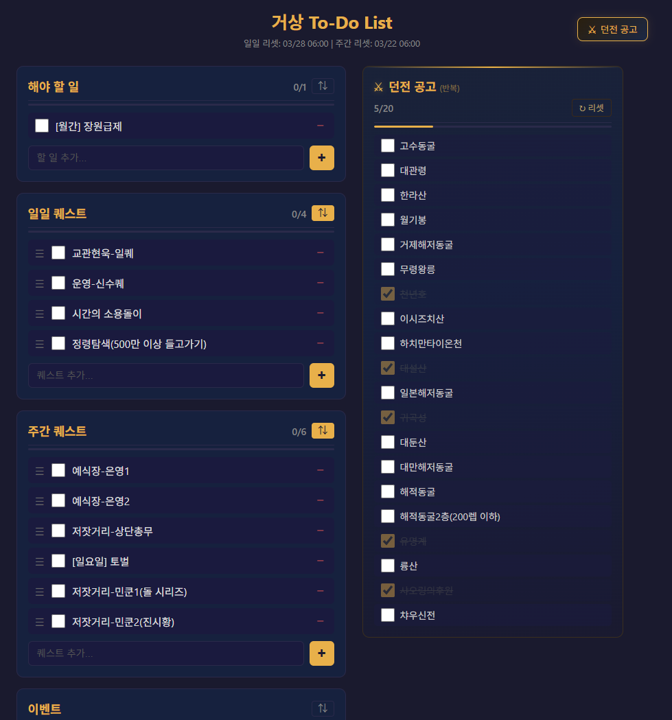

# 거상 To-Do List

거상(온라인 게임) 플레이어를 위한 일일/주간 퀘스트 및 던전 공고 관리 웹 앱

https://helperjby.github.io/gersang-to-do-list/



## 주요 기능

### 퀘스트 관리
- **4개 카테고리**: 해야 할 일, 일일 퀘스트, 주간 퀘스트, 이벤트
- **추가/삭제**: 입력란에서 Enter 또는 + 버튼으로 추가, - 버튼으로 삭제
- **완료 체크**: 체크박스로 완료 표시
- **인라인 편집**: 퀘스트 이름 더블클릭으로 수정
- **순서 변경**: ⇅ 버튼 → 드래그 핸들(☰)로 드래그앤드롭
- **진행률 표시**: 카테고리별 완료/전체 카운트 + 프로그레스 바

### 던전 공고(반복)
- 헤더의 "⚔ 던전 공고" 버튼으로 패널 토글
- 고정 20개 던전 목록 체크리스트
- 개별 던전 제거(✕) 및 전체 리셋(↻) 지원

### 자동 리셋
- **일일 리셋** (매일 06:00): 일일 퀘스트 + 던전 체크 초기화
- **주간 리셋** (매주 일요일 06:00): 주간 퀘스트 초기화

## 기술 스택

- 순수 HTML / CSS / JavaScript (바닐라, 외부 라이브러리 없음)
- localStorage 기반 데이터 저장
- GitHub Pages 배포

## 로컬 실행

```bash
python -m http.server 3000
```

브라우저에서 http://localhost:3000 접속
