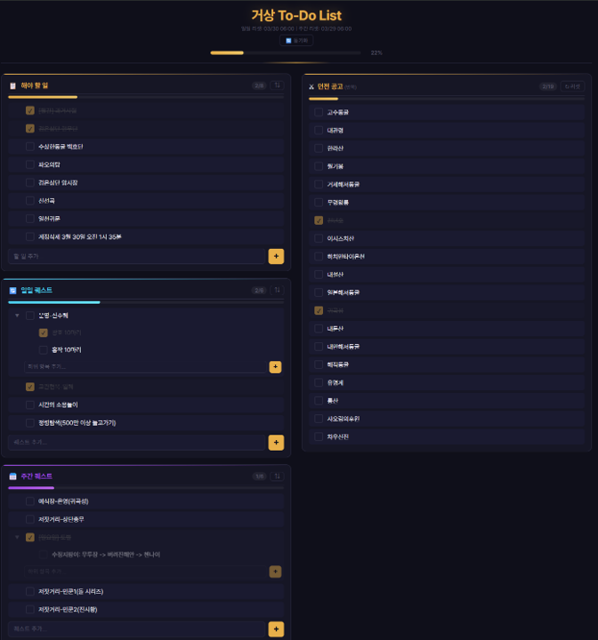

# 거상 To-Do List

거상(온라인 게임) 플레이어를 위한 일일/주간 퀘스트 및 던전 공고 관리 웹 앱

https://gersang-todo.netlify.app

백업: https://helperjby.github.io/gersang-to-do-list/



## 주요 기능

### 퀘스트 관리
- **4개 카테고리**: 📋 해야 할 일, 🔄 일일 퀘스트, 📅 주간 퀘스트, 🎉 이벤트
- **추가/삭제**: 입력란에서 Enter 또는 + 버튼으로 추가, − 버튼으로 삭제 (확인 알럿)
- **완료 체크**: 커스텀 체크박스로 완료 표시 (bounce 애니메이션)
- **인라인 편집**: 퀘스트 이름 더블클릭으로 수정
- **하위 뎁스(Sub-Item)**: 재귀적 다단계 퀘스트 구조, 접기/펼치기(▶/▼) 지원
- **순서 변경**: ⇅ 버튼 → 드래그 핸들(☰)로 드래그앤드롭
- **진행률 표시**: 카테고리별 완료/전체 카운트 + 그라디언트 프로그레스 바
- **전체 진행률**: 헤더 아래 전체 달성률 퍼센트 표시 (100% 시 초록색 glow 효과)

### 던전 공고(반복)
- 고정 20개 던전 목록 체크리스트 (항상 표시)
- 개별 던전 제거(✕, 확인 알럿) 및 전체 리셋(↻) 지원

### 크로스 디바이스 동기화
- Firebase 기반 **6자리 동기화 코드** 생성
- 코드 입력으로 다른 기기에서 데이터 다운로드
- 동기화 코드 7일간 유효
- Firebase 미설정 시에도 앱 정상 동작 (동기화만 비활성)

### 자동 리셋
- **일일 리셋** (매일 06:00): 일일 퀘스트 + 던전 체크 초기화
- **주간 리셋** (매주 일요일 06:00): 주간 퀘스트 초기화

### 디자인
- 게임 UI 스타일 다크 테마
- 카테고리별 색상 구분 (골드/시안/퍼플/그린)
- Pretendard 한글 최적화 웹폰트
- CSS Custom Properties 기반 디자인 시스템

## 기술 스택

- 순수 HTML / CSS / JavaScript (바닐라, 외부 라이브러리 없음)
- Firebase Realtime Database (동기화, CDN)
- Pretendard 웹폰트 (CDN)
- localStorage 기반 데이터 저장

## 배포

- **Netlify** (주 배포): main 브랜치 자동 배포
- **GitHub Pages** (백업 배포)

## 로컬 실행

```bash
python -m http.server 3000
```

브라우저에서 http://localhost:3000 접속
